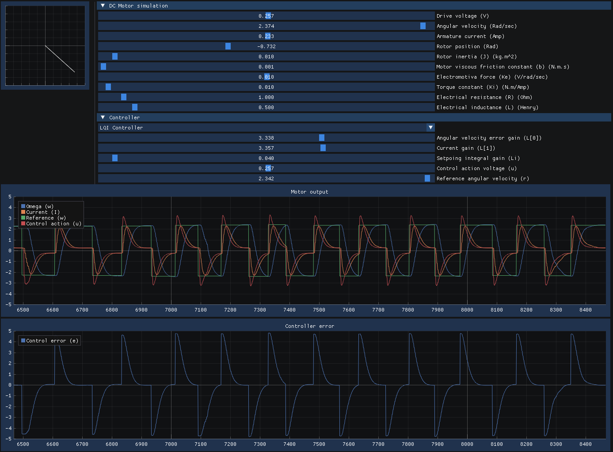

# Embedded Firmware Development Instruments

- [Embedded Firmware Consulting](https://swedishembedded.com/go): get help developing embedded firmware application.
- [Training](https://swedishembedded.com/tag/training): get training.
- [Swedish Embedded Platform SDK](https://github.com/swedishembedded/sdk): get the platform SDK.

## What are instruments?

This project is about creating standalone instruments that can be used together
with Swedish Embedded Platform SDK to enable easy prototyping, simulation and
measurement of signals from embedded systems.

Instruments can be used with Renode by simply mapping them into the address
space of the simulated firmware!

Here is a DC motor instrument:

Here is the same instrument but running in PID mode:

The instrument itself exposes a simple data structure which is then mapped
directly into the address space of the emulated firmware. The emulated firmware
is then able to read simulated motor measurements and write back voltage control
input to the motor.

Using this toolkit you can create and contribute instruments for many different
systems. Open a pull request if you want to get comments on your work (and
improvement suggestions).

## Related projects

|Name|URL|Description|
|----|---|-----------|
|[Swedish Embedded Control Systems Toolkit](https://github.com/swedishembedded/control)|https://swedishembedded/control|Used for mathematical simulation in instruments and embedded controller design|

## Documentation

Precompiled documentation can be found in [instruments.pdf](instruments.pdf).

