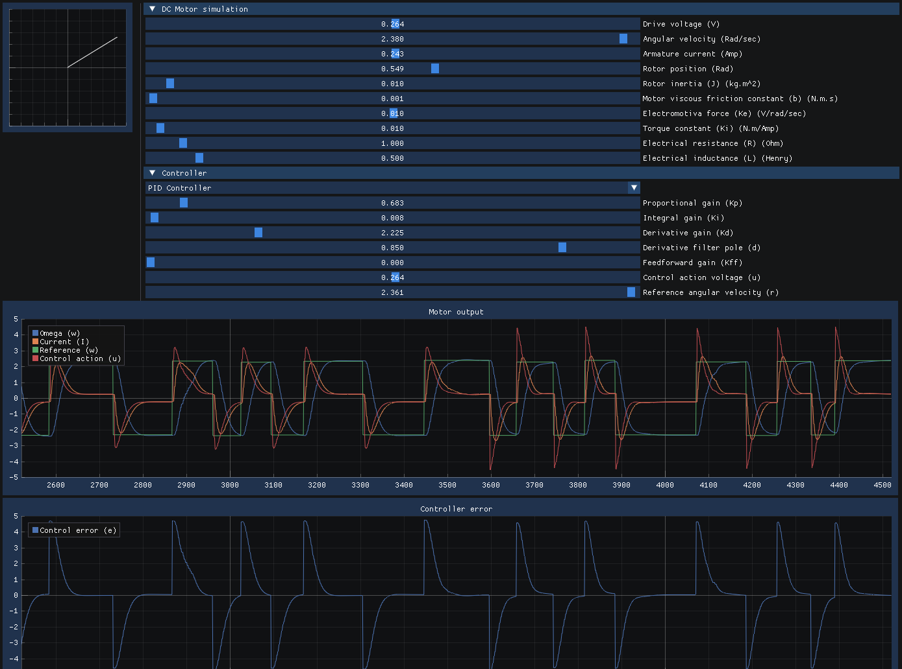
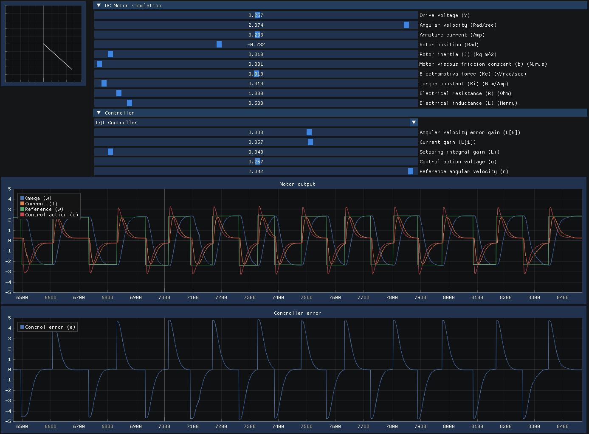

= DC Motor Instrument

This instrument implements a DC motor simulation and also provides means to
input values into the controller (controller typically runs on an embedded
system).

Here is the instrument operating in LQI mode (controller runs in firmware with
instrument only simulating the motor and providing settings for the controller):

== Peripheral Data Structure

[stripes=even,width=100%,cols="1,1,1,4"]
|===
|Offset|Type|Name|Description

|0x00|uint32_t|controller|Instrument controller selection
|0x04|float|L[0]|LQI L matrix element
|0x08|float|L[0]|LQI L matrix element
|0x0c|float|Li|LQI Li integrator gain
|0x10|float|Kp|PID controller proportional gain
|0x14|float|Ki|PID controller integral gain
|0x18|float|Kd|PID controller derivative gain
|0x1c|float|d|PID controller derivateive filter discrete pole (0..1)
|0x20|float|Kff|Feedforward gain
|0x24|float|reference|Controller reference
|0x28|float|omega|Measured angular velocity
|0x2c|float|control|Controller control action (V)
|0x30|uint32_t|tick|Writing to this register runs the simulation one iteration
|0x38|uint32_t|INTF|Interrupt register (currently not used)
|===

These are parameters shared with the controller running on the embedded
firmware. If you are using Swedish Embedded Platform SDK then you can use the
Renode plugin to map the instrument directly into your microcontroller address
space:

..repl file:
[source,c]
--
device: SocketPeripheral @ sysbus <0x70000000, +0x800>
    IRQ -> gpioPortB@8
--

..resc file:
[source,c]
--
device PeripheralPath @/usr/bin/instrument-dcmotor
--

The registers are then available at address 0x70000000 on your microcontroller.
You can include the `instruments/dcmotor.h` file for easy access to these values
from within your simulated firmware.

In such a case, accessing the instrument registers is as simple as defining a
pointer and then using it directly:

[source,c]
--
#include <instruments/dcmotor.h>

static volatile struct dcmotor_instrument *vdev = \
	((volatile struct dcmotor_instrument *)0x70000000);
float y[YDIM] = { -(vdev->reference - vdev->omega) };
--

You must use volatile with all instrument data structures because they are
modified outside of the knowledge of your application (volatile ensures that
memory location is never cached!)

== Parameters explanation

.Motor simulation parameters
[stripes=even,width=100%,cols="2,4"]
|===
|Parameter|Description

|Drive voltage (V)
|This is the drive voltage applied to the motor

|Angular velocity (Rad/sec)
|Measured angular velocity of the rotor

|Armature current (Amp)
|Current through the motor coils

|Rotor position (Rad)
|Position of the rotor

|Rotor inertia (J) (kg.m^2)
|Inertia of the rotor (heavier rotor is slower to respond)

|Motor viscous friction constant (b) (N.m.s)
|Friction that depends on angular velocity (high friction results in high cruising current)

|Electromotiva force (Ke) (V/rad/sec)
|Also sometimes expressed as RPM/V

|Torque constant (Ki) (N.m/Amp)
|This is same value as Ke

|Electrical resistance (R) (Ohm)
|Resistance across motor terminals

|Electrical inductance (L) (Henry)
|Inductance of the motor coils
|===

.PID controller parameters:
[stripes=even,width=100%,cols="2,4"]
|===
|Parameter|Description

|Proportional gain (Kp)
|Gain applied proportionally to the error

|Integral gain (Ki)
|Gain applied to integrated error

|Derivative gain (Kd)
|Gain applied to filtered derivative of the error

|Derivative filter pole (d)
|Derivative filter discrete pole
|===

.LQR controller parameters
[stripes=even,width=100%,cols="2,4"]
|===
|Parameter|Description

|Angular velocity error gain (L[0])
|Control law with respect to angular velocity

|Current gain (L[1])
|Control law with respect to winding current

|Setpoing integral gain (Li)
|Integrator gain for input error signal
|===

.Common variables
[stripes=even,width=100%,cols="2,4"]
|===
|Parameter|Description

|Feedforward gain (Kff)
|Feedforward gain for user input

|Control action voltage (u)
|Output of the controller

|Reference angular velocity (r)
|Angular velocity reference set by user
|===

As you modify these values and have a controller running in your simulated
firmware, you can experiment with different settings to achieve best possible
control action.

== Mathematical Modelling

The motor simulation was designed as follows.

You will need to use symbolic modelling tools available in Swedish Embedded
Control Systems Toolbox for this (default octave tools don't support symbolic
expressions that we need here).

.Start with a continuous time state-space model:
[source,matlab]
--
syms s J b K R L z Ts
A = [-b/J   K/J;
    -K/L   -R/L];
B = [0;
    1/L];
C = [1   0];
D = 0;
sys = ss(A, B, C, D);
--

.Discretize the model using sample time Ts
[source,matlab]
--
sys = c2d(A, B, C, D, Ts);
--

.Generate C code
[source,matlab]
--
display(sys)
ccode(sys)
--

The resulting model is a parametrized model of the DC motor:

[source,c]
--
self->A[0 * 2 + 0] =
	J * (L + R * Ts) / (powf(K, 2) * powf(Ts, 2) + (J + Ts * b) * (L + R * Ts));
self->A[0 * 2 + 1] = K * L * Ts / (powf(K, 2) * powf(Ts, 2) + (J + Ts * b) * (L + R * Ts));
self->A[1 * 2 + 0] = -J * K * Ts / (powf(K, 2) * powf(Ts, 2) + (J + Ts * b) * (L + R * Ts));
self->A[1 * 2 + 1] =
	L * (J + Ts * b) / (powf(K, 2) * powf(Ts, 2) + (J + Ts * b) * (L + R * Ts));
self->B[0 * 1 + 0] =
	K * powf(Ts, 2) /
	(J * L + J * R * Ts + powf(K, 2) * powf(Ts, 2) + L * Ts * b + R * powf(Ts, 2) * b);
self->B[1 * 1 + 0] =
	Ts * (J + Ts * b) /
	(J * L + J * R * Ts + powf(K, 2) * powf(Ts, 2) + L * Ts * b + R * powf(Ts, 2) * b);
self->C[0 * 2 + 0] = 1;
self->C[0 * 2 + 1] = 0;
self->D[0 * 1 + 0] = 0;
--

This model is recalculated at every tick since user is able to change these
values.

== Controller Design

Controller can be designed using the model above.

This uses octave control systems toolbox (since we are calculating with
doubles instead of symbolics so we can use it).

.Start with a symbolic model
[source,matlab]
--
syms s J b K R L z Ts
A = [-b/J   K/J;
    -K/L   -R/L];
B = [0;
    1/L];
C = [1   0];
D = 0;
--

.Substitute symbols with doubles
[source,matlab]
--
A = double(subs(A, [J b K R L], [0.01, 0.001, 0.01, 1, 0.5]))
B = double(subs(B, [J b K R L], [0.01, 0.001, 0.01, 1, 0.5]))
--

.Convert into continuous time state space object
[source,matlab]
--
sys = ss(A, B, C, D);
--

.Determine observability and controllability
[source,matlab]
--
e = eig(A) % all must be negative!
assert(e(1) < 0 && e(2) < 0)
M_o = obsv(sys)
M_c = ctrb(sys)
assert(length(A) - rank(M_o) == 0)
assert(length(A) - rank(M_c) == 0)
--

.Convert into a discrete time model
[source,matlab]
--
sys = c2d(sys, 0.1)
--

.Design controller
[source,matlab]
--
Q = [9 0; 0 1]
R = [1]
sys
[sys_k, K] = kalman(sys, 2.3, 1)
[L, S, P] = lqr(sys, Q, R)
dc_g = dcgain(sys)
--

This gives us the matrices that can be used for running the controller on our
microcontroller. The resulting controller can be implemented like this:

[source,c]
--
float u[RDIM] = { 0 };
float r[RDIM] = { 0 };
float y[YDIM] = { -(vdev->reference - vdev->omega) };

if (vdev->controller == CONTROLLER_PID) {
	pid_set_gains(&pid, vdev->pid.Kp, vdev->pid.Ki, vdev->pid.Kd, vdev->pid.d);
	u[0] = -(vdev->Kff * y[0] + pid_step(&pid, y[0]));
} else if(vdev->controller == CONTROLLER_LQI) {
	float L[RDIM * ADIM] = { vdev->lqi.L[0], vdev->lqi.L[1] };
	float Li[RDIM] = { vdev->lqi.Li };

	float qi = 0.1;
	//Control LQI
	lqi(y, u, qi, r, L, Li, x, xi, ADIM, YDIM, RDIM, 0);
	u[0] -= (vdev->Kff * y[0]);
}

// send control input to the plant
vdev->control = u[0];

// Execute state estimator regardless of controller
kalman(A, B, C, K, u, x, y, ADIM, YDIM, RDIM);

vdev->tick = 1;
--

This example is from Swedish Embedded Platform SDK sample
(samples/lib/control/dcmotor).

== Data Structure Reference

${insert("dcmotor_instrument")}

[stem]
++++
\hat{x} = Ax + Bu
++++
