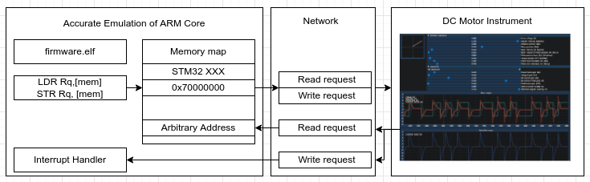
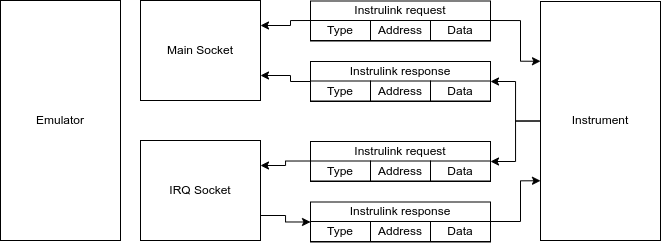

= Instrumentation For Embedded Firmware Development: swedishembedded.com
:stem:
:table-stripes: even

image::screenshot-dcmotor-pid.png[]

- link:https://swedishembedded.com/go[Embedded Firmware Consulting]: get help developing embedded firmware application.
- link:https://swedishembedded.com/tag/training[Firmware Training]: get training.
- link:https://github.com/swedishembedded/sdk[Swedish Embedded Platform SDK]: get the platform SDK.
- link:https://github.com/swedishembedded/instruments[Instrumentation For
  Embedded Firmware Development]: repository this documentation describes.

Embedded firmware development differs from traditional software development in
one very important way: embedded systems have specialized hardware so majority
of the software development for an embedded system has real world hardware
effects.

On a general purpose computer, most of these effects are entirely limited to
pixels on a screen and so making instrumentation for conventional software
development is fairly easy.

For embedded systems, what is needed is a way to model the physical and
electrical effects in software as well, so that we can take the physical problem
entirely into the software domain where we can easily instrument every aspect of
our system.

This is precisely what Swedish Embedded Instruments are for.

Instrumentation is essential for embedded firmware development. Instrumentation
allows you to inspect the internal workings of your firmware in ways that
normally would not be possible.

Of course you can not completely replace a physical system and you should never
only test in software - but many software bugs can easily be identified using
software models which will save you a lot of time by reducing the number of
tests you need to do on a real physical system.

== How this instrumentation kit works

Instruments in this kit are all standalone applications which expose a standard
socket interface to the emulation software. They are designed to be used with
emulation "adapter" such as the one found in Swedish Embedded Platform SDK for
renode which simply spawns an instrument as a separate process, instructing it
to connect to two network sockets through which all subsequent communication is
done.

The emulator adapter taps into the emulation core and catches when firmware
wants to read or write memory - which are requests that can be then converted to
the instrument link protocol (instrulink).

This is why the instrument protocol closesly follows the format of simple
load/store word instructions, having fixed packet structure and packet length.
Essentially the procol is an implementation of "load/store" assembly
instructions designed to operate on bus width of up to 64 bits.

== Two sockets

Each instrument accepts three command line arguments:

- *Main socket*: this is a socket number (automatically generated by OS) to
   which the instrument must connect to receive requests from the emulation
   master. This socket is used for marster to slave request/response
   communication.
- *IRQ socket*: this is a separate socket which works exactly the same way as
   the main socket but instead has requests originated by instrument where
   emulation instead responds with replies. This socket is used for sending
   asynchronous messages from the instrument to the emulation (such as interrupt
   requests).
- *Address*: this is the IP address to which the instrument should connect
   (where sockets are listening). It is the same for both sockets.

== Communication

The communication protocol structure is defined in ${link("instrulink_packet")}.

Each message consists of three fields:

- *Type (uint32_t)*: this is a packet type.
- *Address (uint64_t)*: this is an address that the operation concerns.
- *Value (uint64_t)*: this is the data passed with the operation.

Each packet is exactly the same size - making it easy to implement the protocol
without the need for framing since we always assume that packets are simply the
same size. Usually the communication is done on the local machine so packets
always arrive very reliably (we can make simplifications to the protocol in this
way taking into account the assumption that instruments typically are started
and stopped many times and while an instrument is connected, there is a high
level of reliability in the localhost communication).

Majority of communication usually consists of reads and writes from the firmware
side over the main socket. Occasionally the emulator side needs to either read a
value or notify the firmware of an interrupt. This is done over the IRQ socket.

== How fast is localhost?

Current protocol has been chosen to accomodate for flexibility and a little bit
of margin. For example, we could have used 8 bit id. But would it matter?

Let's investigate.

If we want to transfer 10 values 1000 times each second (typical for a control
system instrument) this amounts to 20 bytes / per value * 1000 * 10 * 8 =
1.6Mbit/s.

Localhost connections are much faster than this:

[source, plaintext]
--
$ iperf3 -s -p 3000
-----------------------------------------------------------
Server listening on 3000
-----------------------------------------------------------
Accepted connection from 127.0.0.1, port 60954
[  5] local 127.0.0.1 port 3000 connected to 127.0.0.1 port 60956
[ ID] Interval           Transfer     Bitrate
[  5]   0.00-1.00   sec  3.29 GBytes  28.2 Gbits/sec
[  5]   1.00-2.00   sec  2.54 GBytes  21.8 Gbits/sec
[  5]   2.00-3.00   sec  3.34 GBytes  28.7 Gbits/sec
[  5]   3.00-4.00   sec  3.27 GBytes  28.1 Gbits/sec
...
$ iperf3 -c localhost -p 3000 -f M
Connecting to host localhost, port 3000
[  5] local 127.0.0.1 port 60956 connected to 127.0.0.1 port 3000
[ ID] Interval           Transfer     Bitrate         Retr  Cwnd
[  5]   0.00-1.00   sec  3.29 GBytes  3365 MBytes/sec    0   3.18 MBytes
[  5]   1.00-2.00   sec  2.54 GBytes  2597 MBytes/sec    0   3.18 MBytes
[  5]   2.00-3.00   sec  3.34 GBytes  3423 MBytes/sec    0   3.18 MBytes
[  5]   3.00-4.00   sec  3.27 GBytes  3351 MBytes/sec    0   3.18 MBytes
--

Quite a lot faster. So given that a typical localhost connection is capable of
doing 28Gbit/sec on a laptop, it's absolutely fine to have 32 bit header
for now. If we want to pass this protocol over UART, we would have an adapter
anyway that does uart framing and probably reduces the number of bits
transmitted back and forth - but that would be a special use case and it would
still fit nicely into the 64 bit bus width to which instruments are connected.

== Instruments summary

- *DC Motor Instrument*: a mathematically correct DC motor simulation. Useful
   for creating embedded DC motor controllers and observing realtime motor data
   (you will need to create an adapter for your UART connection).

${include("dcmotor/index.adoc", leveloffset="+1")}

== Data Structures

${insert("instrulink_packet", leveloffset="+2")}
${insert("instrulink_message_type", leveloffset="+2")}
